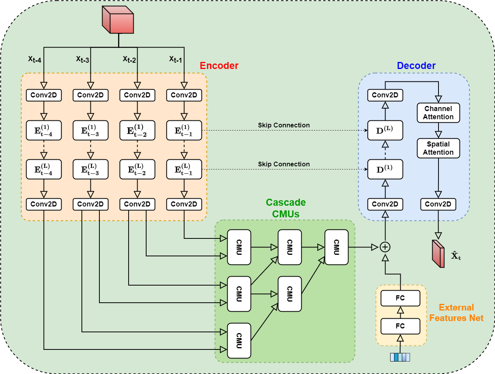
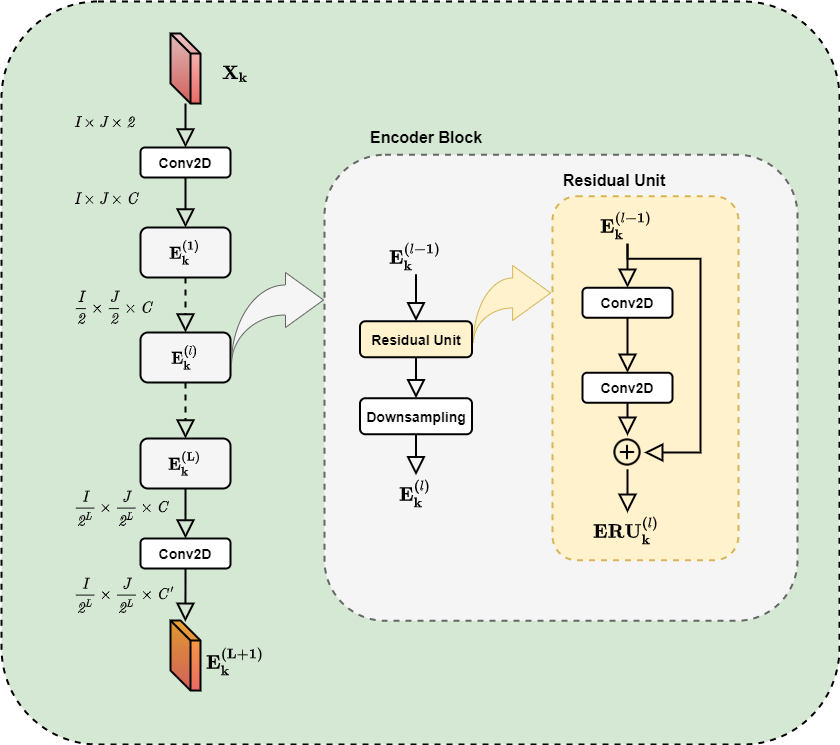
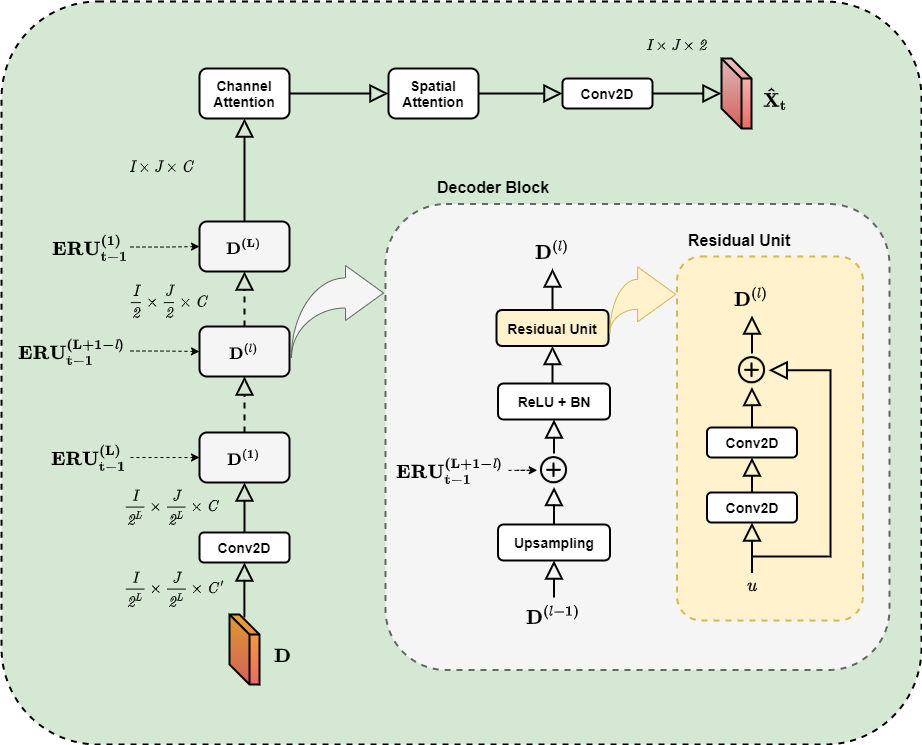

# Check Out `QuickStart`, where I provide out-of-the-box tutorial for you to use this repo!

# Smart Mobility Prediction 
This repository <!-- has been created for a university thesis at Università Bicocca in Milan. It --> contains the implementation and testing code of different deep networks for the traffic flow prediction problem.

## Repository structure
Each of the main folders is dedicated to a specific deep learning network. Some of them were taken and modified from other repositories associated with the source paper, while others are our original implementations. Here it is an exhaustive list:
* **ST-ResNet.** Folder for [[1]](#1). The original source code is [here](https://github.com/amirkhango/DeepST).
* **MST3D.** Folder with our original implementation of the model described in [[2]](#2).
* **Pred-CNN.** Folder for [[3]](#3). The original repository is [here](https://github.com/xzr12/PredCNN).
* **ST3DNet.** Folder for [[4]](#4). The starting-point code can be found [here](https://github.com/guoshnBJTU/ST3DNet).
* **STAR.** Folder for [[5]](#5). Soure code was taken from [here](https://github.com/hongnianwang/STAR).
* **3D-CLoST.** Folder dedicated to a model created during another research at Università Bicocca.
* **STDN.** Folder referring to [[6]](#6). This folder is actually a copy of [this](https://github.com/tangxianfeng/STDN) repository, since it was never used in our experimentes.
* **Autoencoder.** Main folder of this repository, containing the implementation of new models for traffic flow prediction based on encoder-decoder architecture.

The contents of these folders can be a little different from each other, accordingly to the structure of the source repositories. Nevertheless, in each of them there are all the codes used to create input flow volumes, training and testing the models for single step prediction, and to evaluate performance on multi step prediction and transfer learning experiments.

The remaining folders are:
* **baselines**. Contains the code implementing Historical Average and ARIMA approaches to the traffic flow prediction problem.
* **data**. Folder where source data should be put in.
* **helpers**. Contains some helpers code used for data visualization or to get weather info through an external API.

## STREEDNet
STREEDNet (Spatio Temporal REsidual Encoder-Decoder Network) is the new framework developed in this research. Its implementation is in [streednet.py](./Autoencoder/src/streednet.py). Its architecture is shown in the next figure. The main sections are Encoder, Cascade CMUs and Decoder. The encoder models the spatial dependencies of the four input frames, independently. Cascade CMUs are used like in [[3]](#3) to model temporal dependencies. The decoder finally computes the predicted image of traffic flows.

### Encoder
The encoder contains a start convolution layer, *L* encoder blocks and a final convolution layer. An encoder block has a residual unit and a down-sampling layer. This structure is represented in the next picture.

### Decoder
The decoder is almost symmetrical with respect to the encoder. It contains a start and an end convolution layer and *L* decoder blocks. In each decoder block there are an up-sampling layer and a residual unit, with a skip connection which allows informations to flow directly from the encoder. Furthermore, we inserted channel and spatial attention before the last convolution. Their implementation is similar to the ones described in [[7]](#7) and [[8]](#8).

## References
<a id="1">[1]</a> 
Zhang, Junbo, Yu Zheng, and Dekang Qi. "Deep spatio-temporal residual networks for citywide crowd flows prediction." Proceedings of the AAAI Conference on Artificial Intelligence. Vol. 31. No. 1. 2017.

<a id="2">[2]</a>
Chen, Cen, et al. "Exploiting spatio-temporal correlations with multiple 3d convolutional neural networks for citywide vehicle flow prediction." 2018 IEEE international conference on data mining (ICDM). IEEE, 2018.

<a id="3">[3]</a>
Xu, Ziru, et al. "PredCNN: Predictive Learning with Cascade Convolutions." IJCAI. 2018.

<a id="4">[4]</a>
Guo, Shengnan, et al. "Deep spatial–temporal 3D convolutional neural networks for traffic data forecasting." IEEE Transactions on Intelligent Transportation Systems 20.10 (2019): 3913-3926.

<a id="5">[5]</a>
Wang, Hongnian, and Han Su. "STAR: A concise deep learning framework for citywide human mobility prediction." 2019 20th IEEE International Conference on Mobile Data Management (MDM). IEEE, 2019.

<a id="6">[6]</a>
Yao, Huaxiu, et al. "Revisiting spatial-temporal similarity: A deep learning framework for traffic prediction." Proceedings of the AAAI conference on artificial intelligence. Vol. 33. No. 01. 2019.

<a id="7">[7]</a>
Liu, Yang, et al. "Attention-based deep ensemble net for large-scale online taxi-hailing demand prediction." IEEE Transactions on Intelligent Transportation Systems 21.11 (2019): 4798-4807.

<a id="8">[8]</a>
Woo, Sanghyun, et al. "Cbam: Convolutional block attention module." Proceedings of the European conference on computer vision (ECCV). 2018.
